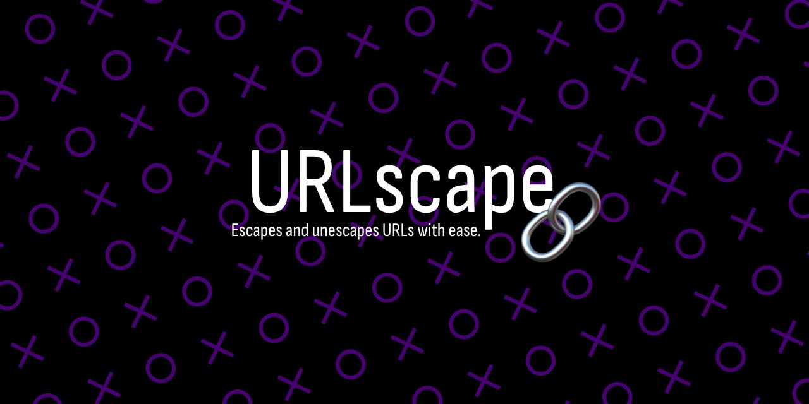

# URLscape: URL Encoder/Decoder 🔗

Escapes and unescapes URLs with ease.

## 📖 Overview



**URLscape** is a lightweight, no‑frills tool for quickly **encoding** and **decoding** URLs.  

Whether you’re a developer, tester, or just someone who’s tired of `%20` clutter, URLscape makes it effortless to switch between human‑readable and URL‑safe formats.

## 🚀 Features

- **Instant Encoding** – Convert text into URL‑safe format.
- **Instant Decoding** – Turn encoded URLs back into readable text.
- **Clean, Minimal UI** – Focus on the task without distractions.
- **Responsive Design** – Works on desktop, tablet, and mobile.
- **Fast & Reliable** – No dependencies, no waiting.

## 🛠️ How to Use

1. **Enter** your text or URL in the input box.
2. Click **Encode** or **Decode**.
3. Copy or use the result instantly.

## 💡 Examples

1. **Input**: `Hello World! How are you?`
   - **Encoded**: `Hello%20World%21%20How%20are%20you%3F`
   - **Decoded**: `Hello World! How are you?`

2. **Input**: `https://example.com/search?q=hello world&category=tech`
   - **Encoded**: `https%3A%2F%2Fexample.com%2Fsearch%3Fq%3Dhello%20world%26category%3Dtech`
   - **Decoded**: `https://example.com/search?q=hello world&category=tech`

3. **Input**: `Special chars: @#$%^&*()`
   - **Encoded**: `Special%20chars%3A%20%40%23%24%25%5E%26%2A%28%29`
   - **Decoded**: `Special chars: @#$%^&*()`

4. **Input**: `Unicode: café résumé`
   - **Encoded**: `Unicode%3A%20caf%C3%A9%20r%C3%A9sum%C3%A9`
   - **Decoded**: `Unicode: café résumé`

5. **Input**: `Email: user@example.com`
   - **Encoded**: `Email%3A%20user%40example.com`
   - **Decoded**: `Email: user@example.com`

## 📦 Installation

Run it locally or host it anywhere that serves static HTML/CSS/JS.

```bash
# Clone the repository
git clone https://github.com/yourusername/urlscape.git

# Open index.html in your browser
```

No build steps. No dependencies. Just open and go.

## 🙌 Contributing

Pull requests are welcome!

If you have ideas for improvements or new features, open an issue or submit a PR.

## 📜 License

This project is licensed under the Apache License 2.0.

See the [LICENSE.txt](./LICENSE.txt) file for the full license text.
