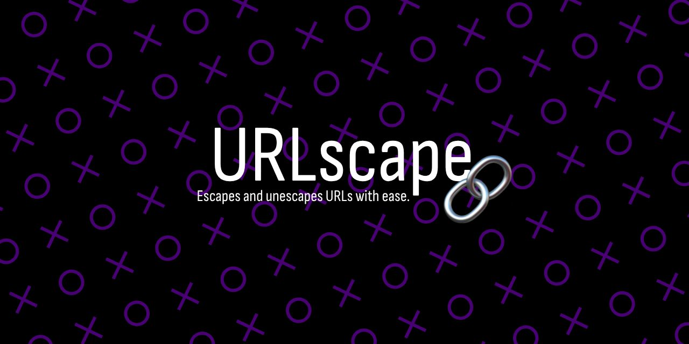

# URLscape: URL Encoder/Decoder

Escapes and unescapes URLs with ease.

## Overview



**URLscape** is a lightweight, client-side tool for **encoding** and **decoding** URLs. Built with Vue 3 and Bulma CSS, it runs entirely in the browser with no server dependency.

## Features

- **Real-time encoding** – Output updates instantly as you type, with auto-detect of encoded vs plain text
- **Bidirectional editing** – Edit either the input or output textarea and the other transforms automatically
- **Dark/Light Theme** – Toggleable, persisted to `localStorage`
- **Per-box Copy & Clear** – Each textarea has inline copy-to-clipboard and clear buttons
- **Character/Byte Count** – Shows `N chars / N bytes` below each textarea
- **URL Validation** – Green ✓ URL badge when input is a valid URL
- **Keyboard Shortcuts** – `Ctrl/Cmd+E` encode, `Ctrl/Cmd+D` decode, `Ctrl/Cmd+Shift+C` copy
- **PWA Ready** – Installable as a standalone app; works offline via service worker
- **Clean, Minimal UI** – Focus on the task without distractions
- **Responsive Design** – Works on desktop, tablet, and mobile
- **Zero Build Step** – Open `index.html` in any browser and go

## How to Use

1. **Enter** your text or URL in the input box — the output updates in real-time
2. **Edit** the output directly to transform it back to the input
3. **Copy** or **Clear** individual textareas using the inline buttons
4. Use **keyboard shortcuts** for encode (`Ctrl+E`), decode (`Ctrl+D`), and copy (`Ctrl+Shift+C`)

## Examples

1. **Input**: `Hello World! How are you?`
   - **Encoded**: `Hello%20World!%20How%20are%20you%3F`
   - **Decoded**: `Hello World! How are you?`

2. **Input**: `https://example.com/search?q=hello world&category=tech`
   - **Encoded**: `https%3A%2F%2Fexample.com%2Fsearch%3Fq%3Dhello%20world%26category%3Dtech`
   - **Decoded**: `https://example.com/search?q=hello world&category=tech`

3. **Input**: `Special chars: @#$%^&*()`
   - **Encoded**: `Special%20chars%3A%20%40%23%24%25%5E%26*()`
   - **Decoded**: `Special chars: @#$%^&*()`

4. **Input**: `Unicode: café résumé`
   - **Encoded**: `Unicode%3A%20caf%C3%A9%20r%C3%A9sum%C3%A9`
   - **Decoded**: `Unicode: café résumé`

5. **Input**: `Email: user@example.com`
   - **Encoded**: `Email%3A%20user%40example.com`
   - **Decoded**: `Email: user@example.com`

## Installation

Run it locally or deploy to any static host.

```bash
git clone https://github.com/nisrulz/urlscape.git
cd urlscape
make serve
```

No build step. No server. Just open and go.

## Tech Stack

- **Vue 3** – Reactive UI components (CDN)
- **Bulma CSS** – Modern CSS framework (CDN)
- **Font Awesome 6** – Icons (CDN)
- **CSS Custom Properties** – Theming system
- **Playwright** – E2E and unit testing

## Contributing

Pull requests are welcome! See [DEV.md](./DEV.md) for development setup.

## License

Apache License 2.0. See [LICENSE.txt](./LICENSE.txt).
